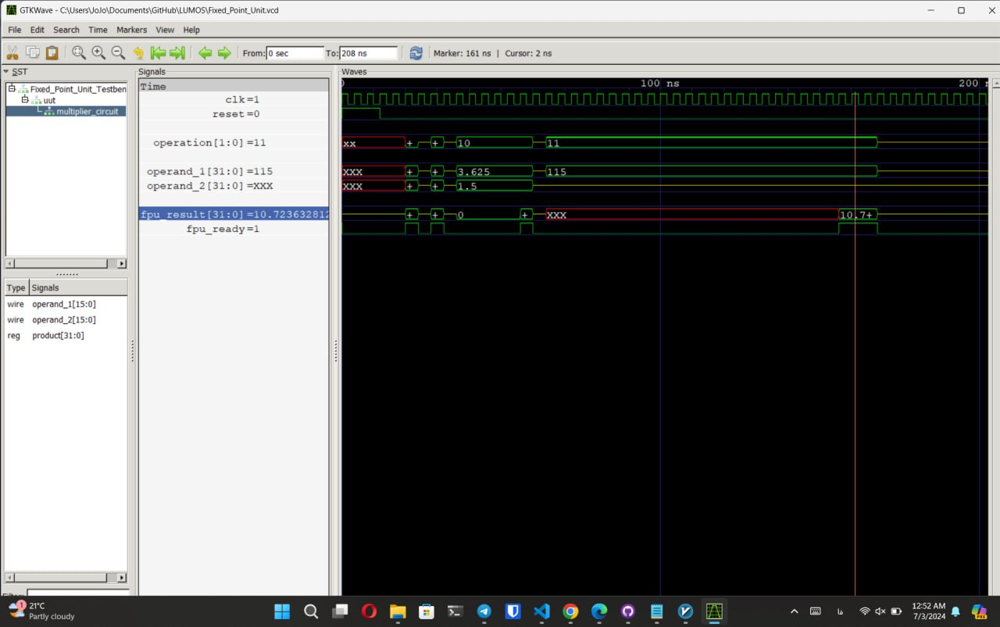
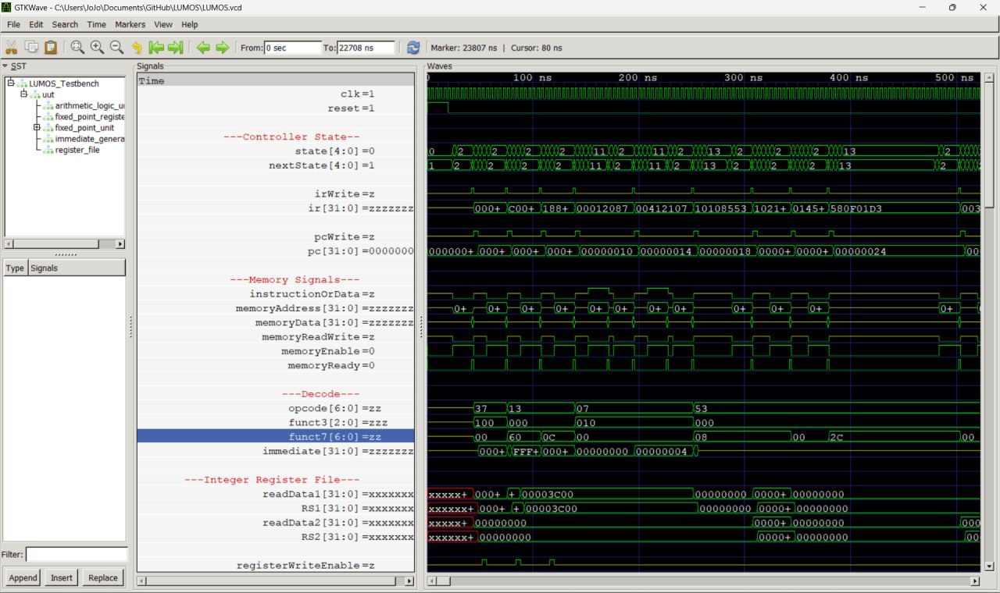
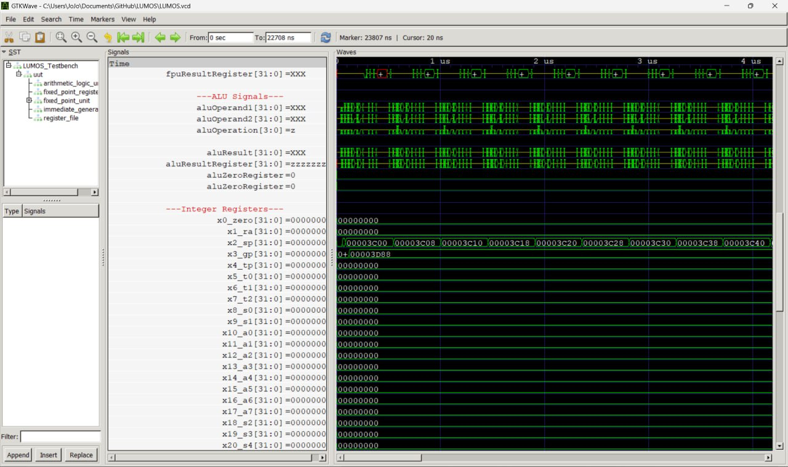
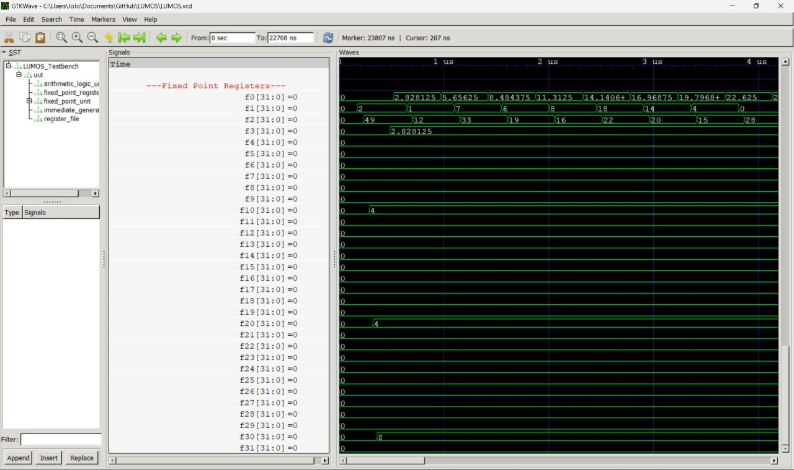
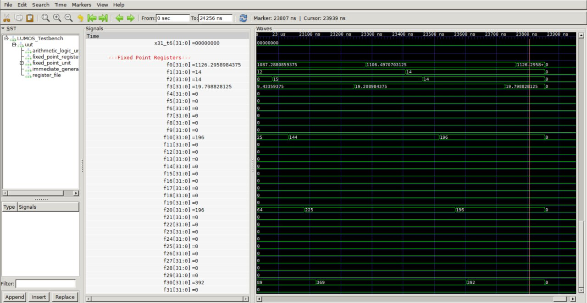

# Computer Organization - Spring 2024

## Iran Univeristy of Science and Technology

Team Members:

Javad Pourrafi      400411243

Aryana Taghavi      400411297
_______________________________________________________________________________________________________________________________________________
# "Assembmly.s"

## Main

### Initialization

    li          sp,     0x3C00

This sets the starting point for the stack pointer (sp). sp is set to 0x3C00 (starting address).

    addi        gp,     sp,     392

This sets the global pointer (gp) to a position 392 units away from the stack pointer. The global pointer represents the end condition for the loop. gp is set to sp + 392.

## Loop:           

### Loop and Loading Values:

    flw         f1,     0(sp)

Load the value from the address pointed to by sp (Load values from 0x3C00) into f1. This can be seen as D1 in the diagram.

    flw         f2,     4(sp)

Load the value from the address sp + 4 (Load values from 0x3C04) into f2. This represents the value at D1x.

### Floating Point Operations:

    fmul.s      f10,    f1,     f1

Square the value loaded from D1x (result stored in f10).

    fmul.s      f20,    f2,     f2

Square the value loaded from D1y (result stored in f20).

    fadd.s      f30,    f10,    f20

Add the results of the squared values (result stored in f30).

    fsqrt.s     x3,     f30

Compute the square root of the sum (result stored in x3).

    fadd.s      f0,     f0,     f3

Accumulate the results (D1) into f0.

### Pointer Adjustment and Loop Control:

    addi        sp,     sp,     8

Move the stack pointer to the next set of values. This corresponds to moving to D2 in the diagram.

    blt         sp,     gp,     loop

Loop Condition: Check if the stack pointer is less than the global pointer. If true, continue the loop, otherwise exit. Repeat the process, incrementing sp and loading values until sp reaches gp.

    ebreak

End the program.
_________________________________________________________________________________________________________________________________________________________________________
# "Fixed_Point_Unit.v"

# Multiplier Module

## Declarations:
-------------------------------------------------
    // ------------------ //
    // Multiplier Circuit //
    // ------------------ //   
    reg [64 - 1 : 0] product;
    reg product_ready;

    reg     [15 : 0] multiplierCircuitInput1;
    reg     [15 : 0] multiplierCircuitInput2;
    wire    [31 : 0] multiplierCircuitResult;

    Multiplier multiplier_circuit
    (
        .operand_1(multiplierCircuitInput1),
        .operand_2(multiplierCircuitInput2),
        .product(multiplierCircuitResult)
    );

    reg     [31 : 0] partialProduct1;
    reg     [31 : 0] partialProduct2;
    reg     [31 : 0] partialProduct3;
    reg     [31 : 0] partialProduct4;
    
    reg[2:0] mul_state;
-------------------------------------------------

## Registers and Wires:

* `product:` 64-bit register to store the final product.

* `product_ready:` A flag indicating that the product is ready.

* `multiplierCircuitInput1` , `multiplierCircuitInput2:` 16-bit registers for inputs to the 16-bit multiplier.

* `multiplierCircuitResult:` 32-bit wire to hold the result from the 16-bit multiplier.

* `partialProduct1` , `partialProduct2` , `partialProduct3` , `partialProduct4:` 32-bit registers to store intermediate partial products.

* `mul_state:` 3-bit register for state machine control.

### Submodule Instantiation:

+ `Multiplier multiplier_circuit:` An instance of the Multiplier module which performs the 16-bit multiplication.

## State Machine and Main Logic:

-------------------------------------------------
    always @(posedge clk or posedge reset)
        begin
            if (reset) begin
                product <= 0;
                mul_state <= 0;
                product_ready <= 0;
            end else if (operation == `FPU_MUL) begin
                case (mul_state)
                    0: begin // Start LL multiplication
                        multiplierCircuitInput1 <= operand_1[15:0];
                        multiplierCircuitInput2 <= operand_2[15:0];
                        mul_state <= 1;
                    end
                    1: begin // LL multiplication done, start LH
                        partialProduct1 <= multiplierCircuitResult;
                        multiplierCircuitInput1 <= operand_1[15:0];
                        multiplierCircuitInput2 <= operand_2[31:16];
                        mul_state <= 2;
                    end
                    2: begin // LH multiplication done, start HL
                        partialProduct2 <= multiplierCircuitResult << 16;
                        multiplierCircuitInput1 <= operand_1[31:16];
                        multiplierCircuitInput2 <= operand_2[15:0];
                        mul_state <= 3;
                    end
                    3: begin // HL multiplication done, start HH
                        partialProduct3 <= multiplierCircuitResult << 16;
                        multiplierCircuitInput1 <= operand_1[31:16];
                        multiplierCircuitInput2 <= operand_2[31:16];
                        mul_state <= 4;
                    end
                    4: begin // HH multiplication done, combine results
                        partialProduct4 <= multiplierCircuitResult << 32;
                        mul_state <= 5;
                    end
                    5: begin 
                        product <= partialProduct4 + partialProduct3 + partialProduct2 + partialProduct1;
                        product_ready <= 1;
                    end
                    default: mul_state <= 0;
                endcase
            end
        end
-------------------------------------------------
## Reset Logic:

When reset is high, it sets product to 0, mul_state to 0, and product_ready to 0.

## State Machine for Multiplication:

- `State 0:` Load the lower 16 bits of both operands and start the first multiplication (LL multiplication).

- `State 1:` Store the result of the LL multiplication, load the lower 16 bits of operand_1 and upper 16 bits of operand_2 for the next multiplication (LH multiplication).

- `State 2:` Store the result of the LH multiplication (shifted left by 16 bits), load the upper 16 bits of operand_1 and lower 16 bits of operand_2 for the next multiplication (HL multiplication).

- `State 3:` Store the result of the HL multiplication (shifted left by 16 bits), load the upper 16 bits of both operands for the next multiplication (HH multiplication).

- `State 4:` Store the result of the HH multiplication (shifted left by 32 bits).

- `State 5:` Combine all partial products to get the final product and set the product_ready flag.

## Multiplier Module:
-------------------------------------------------
    module Multiplier
    (
        input wire [15 : 0] operand_1,
        input wire [15 : 0] operand_2,
        output reg [31 : 0] product
    );

        always @(*)
        begin
            product <= operand_1 * operand_2;
        end
    endmodule
-------------------------------------------------
This module performs the multiplication of two 16-bit operands(input Signals) and produces a 32-bit product(Output Signal).
_________________________________________________________________________________________________________________________________________________________________________
# Square Root Circuit:

## Declarations
-------------------------------------------------
    // ------------------- //
    // Square Root Circuit //
    // ------------------- //
    // Register declarations
    reg [WIDTH - 1 : 0] root;           // Stores the final square root result
    reg root_ready;                     // Flag indicating when the result is ready
    reg [1 : 0] s_stage;      // Current stage of the square root operation
    reg [1 : 0] next_s_stage; // Next stage of the square root operation
    reg sqrt_start;                     // Flag to start the square root calculation
    reg sqrt_busy;                      // Flag indicating the calculation is in progress
    reg [WIDTH - 1 : 0] op1, op1_next;      // Operand and its next value in the calculation
    reg [WIDTH - 1 : 0] q, q_next;      // Partial result and its next value
    reg [WIDTH + 1 : 0] ac, ac_next;    // Accumulator and its next value
    reg [WIDTH + 1 : 0] test_res;       // Temporary result for comparison

    // Calculate the number of iterationations based on WIDTH and FBITS
    localparam iteration = (WIDTH + FBITS) / 2;     
    reg [4 : 0] i = 0;                  // iterationation counter
-------------------------------------------------

## Registers and Wires:

* `root:` Stores the final square root result.

* `root_ready:` Indicates when the result is ready.

* `s_stage` , `next_s_stage:` Registers to hold the current and next stages of the state machine.

* `sqrt_start:` Flag to start the square root calculation.

* `sqrt_busy:` Flag indicating the calculation is in progress.

* `op1` , `op1_next:` The operand being operated on and its next value.

* `q` , `q_next:` Partial result of the square root and its next value.

* `ac` , `ac_next:` Accumulator used in the calculation and its next value.

* `test_res:` Temporary result for comparison in the algorithm.

### Parameters:

+ `iteration:` Number of iterations required, calculated based on the width of the operands (WIDTH) and fractional bits (FBITS).

+ `i:` Counter for the number of iterations.

## State Machine for Control
-------------------------------------------------
    always @(posedge clk) 
    begin
        if (operation == `FPU_SQRT) 
            s_stage <= next_s_stage;
        else begin
            s_stage <= 2'b00;
            root_ready <= 0;
        end
    end 
-------------------------------------------------

> This always block updates the current stage (s_stage) based on the next_s_stage.

> If the operation is FPU_SQRT, it updates s_stage to next_s_stage.

> If the operation is not FPU_SQRT, it resets the s_stage to 0 and clears the root_ready flag.

## Combinational Logic for Next Stage
-------------------------------------------------
    always @(*) 
    begin
        next_s_stage <= 'bz;
        case (s_stage)
            2'b00 : begin sqrt_start <= 0; next_s_stage <= 2'b01; end
            2'b01 : begin sqrt_start <= 1; next_s_stage <= 2'b10; end
            2'b10 : begin sqrt_start <= 0; next_s_stage <= 2'b10; end
        endcase    
    end             
-------------------------------------------------

`always block` determines the next state of the state machine based on the current state (s_stage).

* In state 2'b00, it sets sqrt_start to 0 and transitions to state 2'b01.

* In state 2'b01, it sets sqrt_start to 1 and transitions to state 2'b10.

* In state 2'b10, it sets sqrt_start to 0 and remains in state 2'b10.

## Core Square Root Calculation Logic
-------------------------------------------------
    always @(*)
    begin
        // Calculate the test result
        test_res = ac - {q, 2'b01};

        if (test_res[WIDTH + 1] == 0) 
        begin
            // If test_res is non-negative, update ac and op1, set least significant bit of q to 1
            {ac_next, op1_next} = {test_res[WIDTH - 1 : 0], op1, 2'b0};
            q_next = {q[WIDTH - 2 : 0], 1'b1};
        end 
        else begin
            // If test_res is negative, shift ac and op1, shift q left
            {ac_next, op1_next} = {ac[WIDTH - 1 : 0], op1, 2'b0};
            q_next = q << 1;
        end
    end
-------------------------------------------------

This block performs the core square root calculation.

* `test_res` is calculated by subtracting {q, 2'b01} from ac.

* If test_res is `non-negative` (test_res[WIDTH + 1] == 0), it updates ac and op1 and sets the least significant bit of q to 1.

* If test_res is `negative`, it shifts ac and op1 left and shifts q left.

## Sequential Logic for Square Root Calculation
-------------------------------------------------
    // Sequential logic for square root calculation
    always @(posedge clk) 
    begin
        if (sqrt_start)
        begin
            // Initialize variables for a new calculation
            sqrt_busy <= 1;
            root_ready <= 0;
            i <= 0;
            q <= 0;
            {ac, op1} <= {{WIDTH{1'b0}}, operand_1, 2'b0};
        end
        else if (sqrt_busy) 
        begin
            if (i == iteration-1) 
            begin
                // Calculation is complete
                sqrt_busy <= 0;
                root_ready <= 1;
                root <= q_next;
            end
            else begin 
                // Proceed to next iterationation
                i <= i + 1;
                op1 <= op1_next;
                ac <= ac_next;
                q <= q_next;
                root_ready <= 0;
            end
        end
    end
-------------------------------------------------

* This block handles the initialization and progression of the square root calculation.

    * If `sqrt_start` is high, it initializes the variables and starts the calculation.

    * If `sqrt_busy` is high, it continues the calculation.

        * If the iteration counter *i* has reached "iteration-1", it completes the calculation and sets root_ready to 1.

        * Otherwise, it proceeds to the next iteration, updating `op1` , `ac` , `q` , and the iteration counter *i*.

### Waveforms:

#### Multiplier

#### Square Root

### Final Simulation Results:

